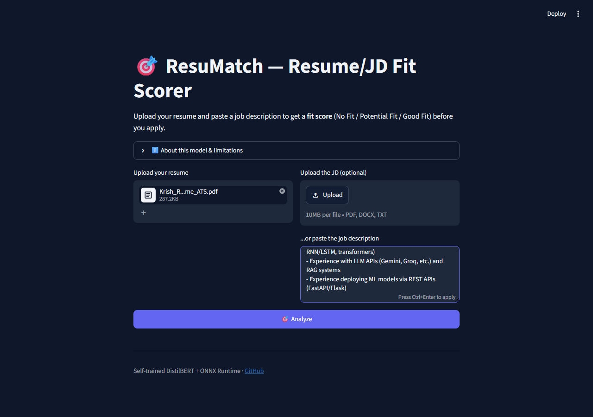
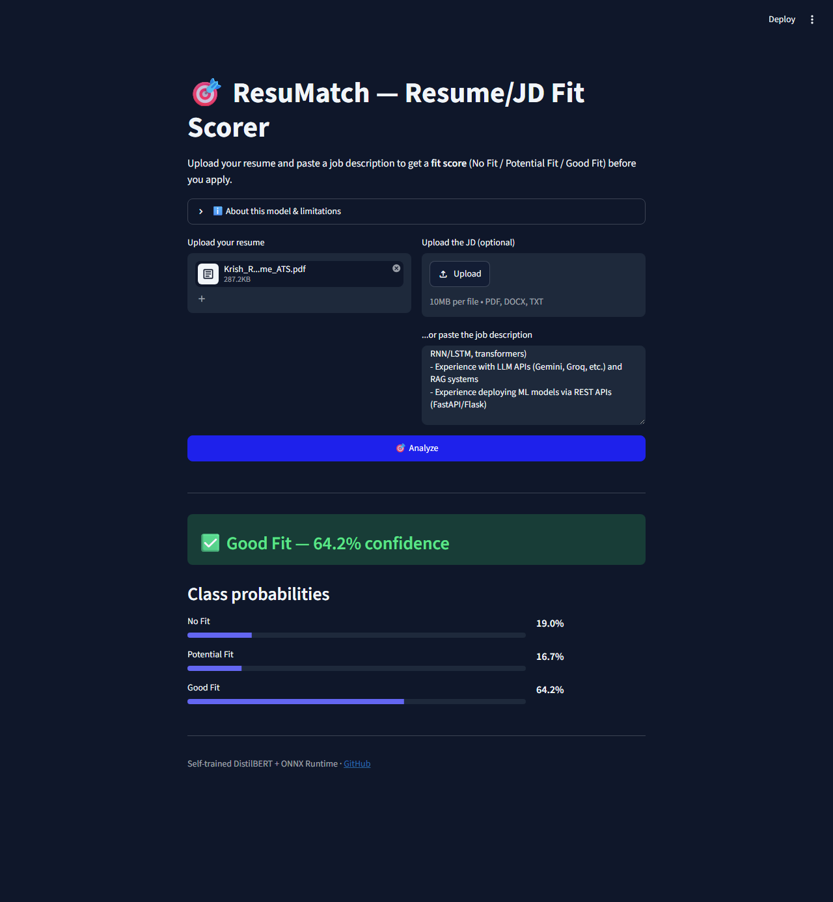

# 🎯 ResuMatch

A Streamlit web app that scores how well a resume matches a job description — **No Fit / Fit** — using a self-trained DistilBERT classifier.


**[🚀 Live Demo → resumatch-zrik.streamlit.app](https://resumatch-zrik.streamlit.app/)**

> See [Model Performance](#-model-performance) below — a real data-leakage bug was found,
> fixed, and the model retrained; the story's worth reading, not just the number.

---

<table>
  <tr>
    <td></td>
    <td></td>
  </tr>
  <tr>
    <td align="center"><em>Upload — resume file, JD upload or paste</em></td>
    <td align="center"><em>Result — fit verdict and per-class probabilities</em></td>
  </tr>
</table>

---

## Demo


Try it live at **[resumatch-zrik.streamlit.app](https://resumatch-zrik.streamlit.app/)**

---

## ✨ Features

- 📄 Upload a resume (PDF / DOCX / TXT); upload the JD too, or paste its text (or both)
- 🧩 Full resume/JD text is read in chunks and averaged, not just the first ~350/150 tokens
- 🤔 Flags close calls (top two classes within 10%) instead of showing a falsely confident verdict
- 🎯 Binary fit score (No Fit / Fit) with confidence bars
- ⚡ Runs on CPU — no GPU needed for inference

---

## 🧠 Scope Note

Fine-tuned on [cnamuangtoun/resume-job-description-fit](https://huggingface.co/datasets/cnamuangtoun/resume-job-description-fit)
(8,000 real resume-JD pairs). The dataset's original 3-way label (No Fit / Potential Fit / Good
Fit) is merged to binary (No Fit / Fit) -- Potential Fit and Good Fit both mean "worth applying,"
so the 3-way split wasn't adding decision-relevant signal. This is a text-similarity signal from a trained
classifier, not a hiring decision or a guarantee of interview success — always tailor your
actual application.

---

## 🛠️ Tech Stack

| Tool | Purpose |
|------|---------|
| [Streamlit](https://streamlit.io) | Web app framework |
| DistilBERT (ONNX, int8-quantized) | Resume/JD fit classification |
| [ONNX Runtime](https://onnxruntime.ai) | CPU inference |
| [tokenizers](https://github.com/huggingface/tokenizers) | Lightweight tokenization (no TensorFlow at inference) |
| pdfplumber / python-docx | Resume text extraction |
| TensorFlow/Keras + transformers | Training (Kaggle, CPU-only) |

---

## 📈 Model Performance

| Metric | Value |
|--------|-------|
| Test macro-F1 (deployed int8 model, val-tuned threshold) | **0.576** |
| Test macro-F1 (fp32, pre-quantization) | 0.565 |
| Val macro-F1 (properly group-split, tracks test closely) | 0.612 (epoch 2, best) |
| Naive "always predict majority class" baseline | ~0.34 |
| Model | DistilBERT, int8-quantized ONNX (~65MB) |
| Training data | 5,463 rows (Kaggle, CPU-only by design, ~159 min/epoch, early-stopped after epoch 4) |
| Test data | 1,759 rows, held out by the dataset's original authors |

**Found a bug, fixed it, retrained — not just a caveat.** The first version of this model hit a
val macro-F1 of 0.647 during training, but scored only 0.372/0.387 on the real held-out test
set. That gap wasn't noise; it was leakage baked into how the dataset is structured. The
published `train.csv` only contains **279 unique job descriptions** reused across 5,304 rows
(each JD paired with many different resumes). A naive random row-level val split put **231 of
232 val job descriptions into train too** (just paired with a different resume) — val was
measuring "generalize to a new resume against an already-seen JD," an easier task than the
real one, and useless as a signal for picking the best checkpoint during training.

**The fix:** [`prepare_dataset.py`](training/scripts/prepare_dataset.py) now uses a
**group-split** (`GroupShuffleSplit` on `job_description_text`) so val's job descriptions never
overlap train's — matching how the official `test.csv` is already structured. Retraining with
this fix immediately paid off: **val macro-F1 correctly caught overfitting after epoch 3**
(train macro-F1 kept climbing to 0.71 by epoch 4, but honest val *dropped*), something the old
leaky val could never see since it just climbed every epoch. Selecting the true best checkpoint
(epoch 3, not epoch 4) instead of just taking whatever the last epoch happened to be pushed the
real test score from **0.372 → 0.410** in that original PyTorch, 3-class training run — a
genuine improvement, not just a more honest number.

**Two further changes, both verified with real retrains, not assumptions:**
1. Ported training to TensorFlow/Keras via KerasHub (see Tech Stack above). Same fixed,
   group-split pipeline, same 3-class label — landed at test macro-F1 **0.384**, a real
   regression from 0.410. The val curve was still climbing at epoch 4 with no overfitting yet
   (unlike the PyTorch run above), meaning that model was undertrained, not at its ceiling.
2. Collapsed the label to binary (`No Fit` / `Fit`, merging the dataset's original Potential Fit
   and Good Fit) and bumped epochs 4 → 6 with early stopping. This was a genuine product
   decision, not just a way to inflate the score — Potential Fit and Good Fit both mean "worth
   applying," so the 3-way split wasn't adding decision-relevant signal, just a fuzzier boundary
   to get wrong. It also happens to balance the classes far better (~50/50 vs ~50/25/25), which
   is most of *why* it trains so much better: val macro-F1 (0.612) and test macro-F1 (0.556) are
   both large, genuine jumps over every prior version — not a metric-gaming artifact, since the
   naive majority-class baseline moved too (~0.22 → ~0.34 for this near-balanced split), and
   0.556 is still ~1.6x that baseline.
3. Tuned the decision threshold on the val set instead of using the default 0.5 argmax. At 0.5,
   the model measurably over-predicted `Fit` (No Fit recall 0.37 vs Fit recall 0.78 on test) —
   raising the bar to `P(Fit) > 0.54` rebalances recall *and* improves test macro-F1 (0.556 →
   0.576), picked on val and verified independently on test so it isn't just fit to look good on
   one split. Lives in `app.py`'s `FIT_THRESHOLD` constant, not the model weights.

0.576 macro-F1 is real, above-baseline signal (~1.7x the naive majority-class baseline) but still
modest — treat this as an honest, properly-validated model, not a polished production
classifier.

---

## 🚀 Getting Started

### 1. Train the model (Kaggle notebook, internet enabled -- runs CPU-only by design)

```bash
cd training/scripts
python prepare_dataset.py --output_dir /kaggle/working/data
python train.py --config ../configs/train_config.yaml
python evaluate.py --config ../configs/train_config.yaml \
    --checkpoint /kaggle/working/runs/resumefit_distilbert_v1/checkpoints/best.keras
python export_model.py \
    --checkpoint /kaggle/working/runs/resumefit_distilbert_v1/checkpoints/best.keras \
    --output ../../models/resume_fit_distilbert.onnx
```

Download the resulting `models/resume_fit_distilbert.onnx`, `models/tokenizer.json`, and
`models/labels.json` back into this repo.

### 2. Run the app

```bash
pip install -r requirements.txt
streamlit run app.py
```

Open [http://localhost:8501](http://localhost:8501) in your browser.

---

## ⚙️ How It Works

1. Upload a resume (PDF/DOCX/TXT) and provide a JD — upload a file, paste text, or both
   (if both are filled, they're combined into one JD and you're warned about it)
2. Resume and JD text are each split into token-budget chunks (350 / 150 tokens — DistilBERT's
   512-token limit) and every chunk pairing is scored as `[CLS] resume-chunk [SEP] jd-chunk [SEP]`,
   then averaged — so the full documents are read, not just the first slice
3. If the top two predicted classes are within 10 percentage points, a "close call" banner is
   shown instead of a confident verdict — a near-tie is the model being honestly uncertain, not
   quietly leaning one way
4. Otherwise, the top class is shown as the verdict, with all three class probabilities as bars

---

## 📝 License

MIT — feel free to use, modify, and share.
